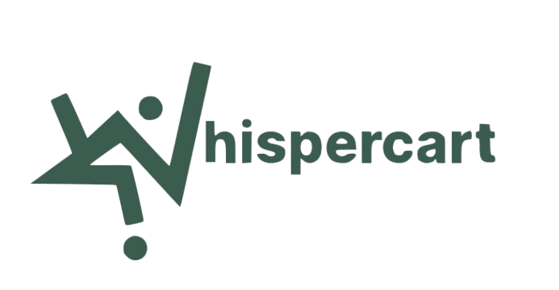

<p align="center">
  
</p>

<h1 align="center">WhisperCart</h1>

<p align="center">
  <strong>Platform E-Commerce Serba Ada dengan Asisten Belanja AI</strong>
</p>

<p align="center">
  Toko online serba ada seperti Shopee yang dilengkapi dengan asisten AI pintar untuk membantu pembeli menemukan produk yang sesuai lewat obrolan santai.
</p>

<p align="center">
  <!-- Front-End Badges -->
  
  
  
  
  <br>
  <!-- Back-End & Database Badges -->
  
  
  
</p>

---

## 📌 Tentang Proyek & Pembeda Utama

### Latar Belakang
WhisperCart adalah proyek website *e-commerce* bebas yang menjual berbagai macam kategori produk (seperti pakaian, elektronik, kebutuhan rumah tangga, dan lainnya) mirip seperti **Shopee**. 

### Pembeda Utama
Jika e-commerce biasa hanya menyediakan kolom pencarian kata kunci, **WhisperCart memiliki keunggulan berupa fitur Asisten AI**. Fitur ini bertindak seperti pelayan toko pribadi yang bisa membantu merekomendasikan produk secara langsung ketika pembeli mengetik kebutuhan mereka menggunakan bahasa sehari-hari.

---

## 🎯 Target Pengguna

Masyarakat umum dan pembeli online yang biasa berbelanja produk sehari-hari di e-commerce, yang menginginkan cara praktis dan cepat dalam mencari barang tanpa harus bingung memilih satu per satu.

---

## 🛠️ Fitur Utama Website & Cara Kerjanya

1. 💬 **Asisten Belanja AI (Whisper AI)**
   - **Cara Kerja**: Pembeli bisa mengetikkan kalimat belanja dengan bahasa sehari-hari (contoh: *"Cari sepatu lari di bawah 200 ribu"* atau *"Rekomendasi kado ulang tahun untuk teman yang suka fotografi"*). AI akan memahami maksud pembeli dan langsung menampilkan daftar produk yang cocok di panel sebelah kanan secara otomatis.

2. 🛒 **Beli Semua Paket AI (Sekali Klik)**
   - **Cara Kerja**: Ketika AI memberikan beberapa rekomendasi produk sekaligus, pembeli tidak perlu mengklik produk satu per satu. Tersedia tombol sekali klik untuk langsung memasukkan seluruh paket rekomendasi tersebut ke dalam keranjang belanja.

3. 🛍️ **Katalog Produk & Keranjang Belanja**
   - **Cara Kerja**: Pembeli dapat menjelajahi katalog barang secara manual, menambah atau mengurangi jumlah item di keranjang, serta memasukkan kode kupon diskon.

4. 💳 **Pilihan Pembayaran Lengkap**
   - **Cara Kerja**: Mendukung pilihan pembayaran umum seperti Transfer Bank / M-Banking (BCA, Mandiri, BRI, BNI), E-Wallet (GoPay, OVO, DANA, ShopeePay), dan COD (Bayar di Tempat). Tampilan sub-opsi bank atau e-wallet akan muncul secara otomatis sesuai metode utama yang dipilih pembeli.

5. 🧾 **Rincian Biaya Transparan**
   - **Cara Kerja**: Sebelum melakukan pembayaran, sistem akan menghitung dan menampilkan rincian harga barang, estimasi biaya pengiriman (ongkir), serta pajak PPN 11% secara terbuka.

---

## 🔄 Alur Belanja di Website (Prototipe)

1. **Membuka Website**: Pembeli masuk ke halaman utama WhisperCart.
2. **Mencari Produk**: Pembeli bisa mencari barang secara manual di katalog produk atau mengobrol langsung dengan Asisten AI di halaman Whisper AI.
3. **Memilih Barang**: Pembeli menambahkan barang ke keranjang (bisa per barang atau sekaligus lewat paket rekomendasi AI).
4. **Memeriksa Keranjang**: Pembeli melihat rincian harga barang, ongkir, dan pajak PPN 11%.
5. **Melakukan Pembayaran**: Pembeli memilih metode pembayaran (M-Banking, E-Wallet, atau COD) dan mengonfirmasi pembayaran pada modal simulasi.
6. **Menyelesaikan Transaksi**: Pembeli menerima konfirmasi pembayaran berhasil dan dapat melihat daftar pembelian pada halaman Riwayat Pesanan.

---

## 💻 Panduan Menjalankan Proyek Secara Lokal

1. **Klon Repositori**:
   ```bash
   git clone https://github.com/RyukaAngga/WhisperCart.git
   cd WhisperCart
   ```

2. **Instal Dependensi**:
   ```bash
   npm install
   ```

3. **Jalankan Server**:
   ```bash
   node server/index.js
   ```

4. **Buka di Browser**:
   Buka `http://localhost:3000` atau jalankan file `index.html`.

---

<p align="center">
  Proyek E-Commerce WhisperCart
</p>
